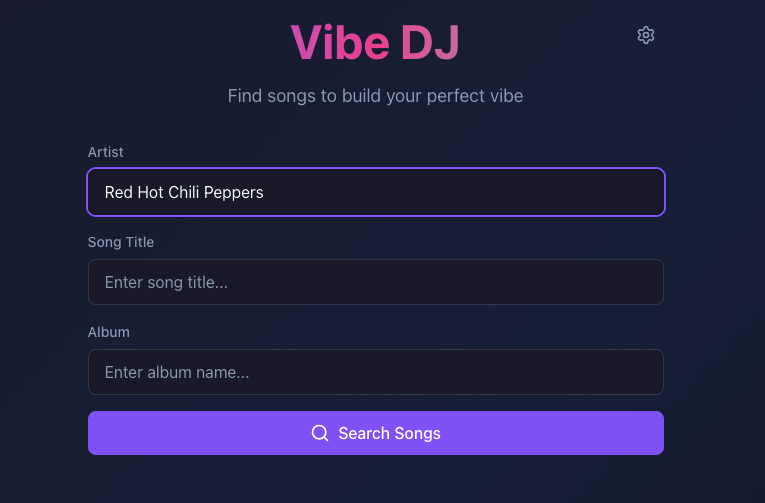
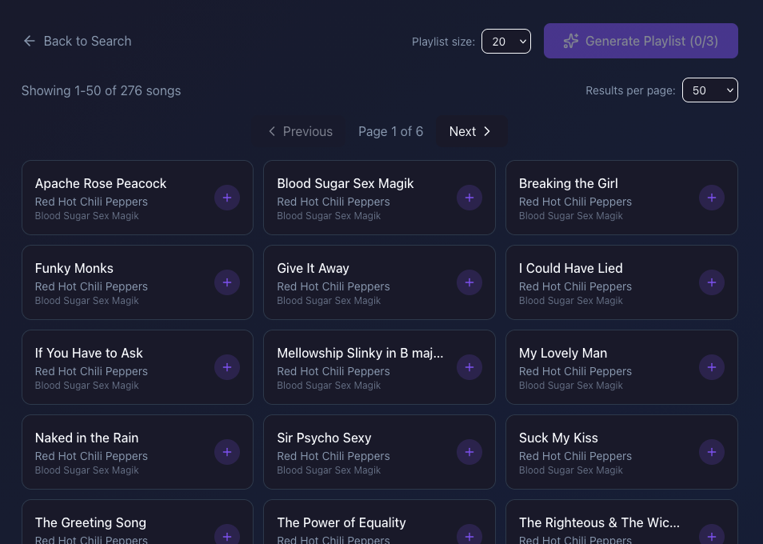
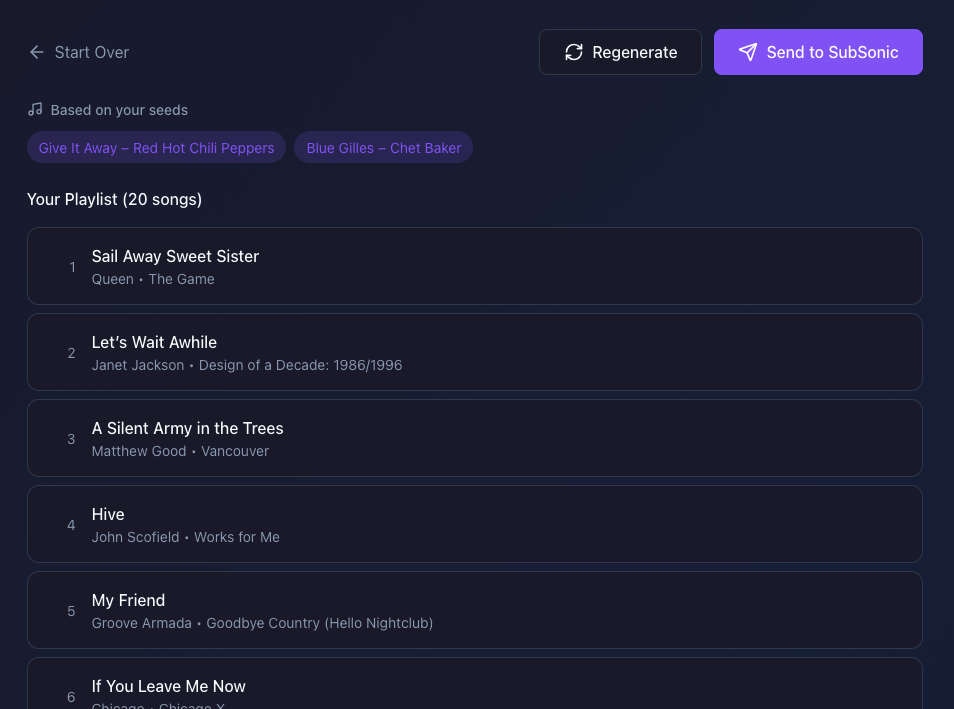
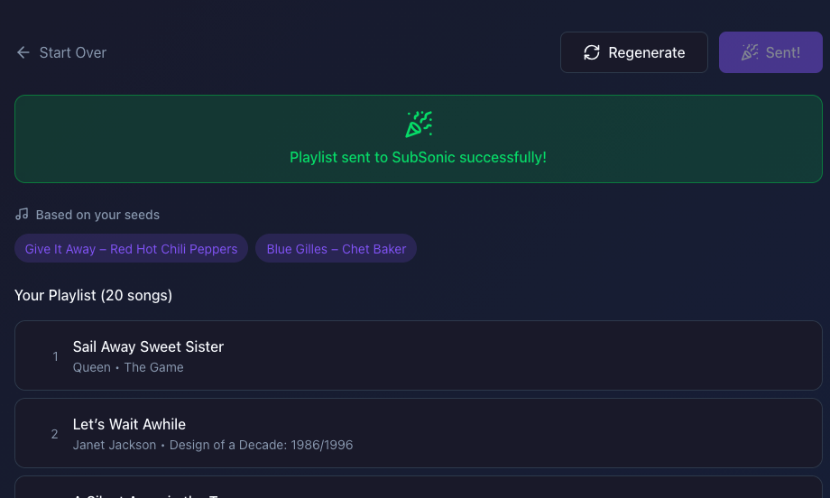
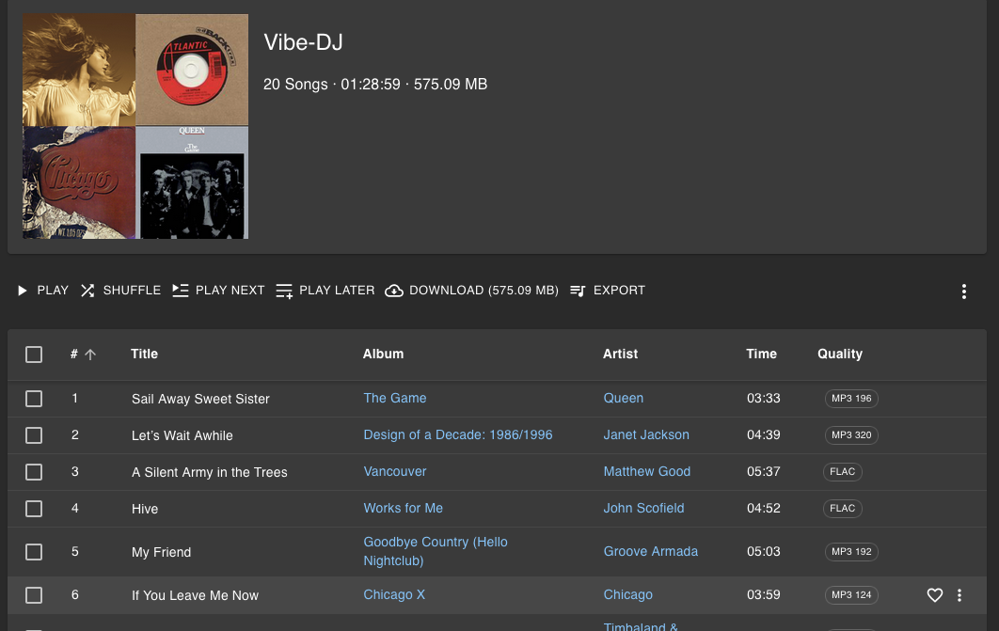

    

**Vibe-DJ** is your personal AI-powered DJ that turns a few favorite tracks into an entire playlist that feels just right.

Simply search your music library and pick up to three songs. Maybe a fiery Jeff Beck solo, a soulful Coltrane ballad, and a heavy Metallica riff. Then watch Vibe-DJ analyze their sonic DNA (energy, mood, timbre, tempo, and more) to craft a seamless playlist pulling similar vibes from the rest of your collection.

It's like whispering to a real DJ: "Blend a little of this, a dash of that, and crank up the spice." No more endless scrolling. Just pure musical alchemy from your own library.

---

### Search Your Music Library

### Select Your Inspiration

### Generate Your Playlist

### Send it to SubSonic

### Enjoy The Vibes

## How It Works

1. **Index your library** via the web UI settings page — scans audio files and extracts features
2. **Search for songs** to use as seeds for playlist generation
3. **Generate a playlist** — the API finds similar songs using FAISS and sorts by BPM
4. **Sync to Subsonic** — push the generated playlist to a Navidrome/Subsonic server

### Subsonic Sync

When syncing a playlist to Subsonic, songs are matched using a three-tier search strategy:

- **Primary**: Search by title + artist + album (most accurate)
- **Fallback 1**: Search by title + artist
- **Fallback 2**: Search by title only

If a playlist with the same name already exists on Subsonic, it is updated with the new song list. Songs that cannot be matched are skipped gracefully.

**Note**: Song matching accuracy depends on metadata consistency between your local library and Subsonic. Ensure your music files have proper ID3 tags for best results.

## Development

More info [here](./docs/development/contributing.md).
